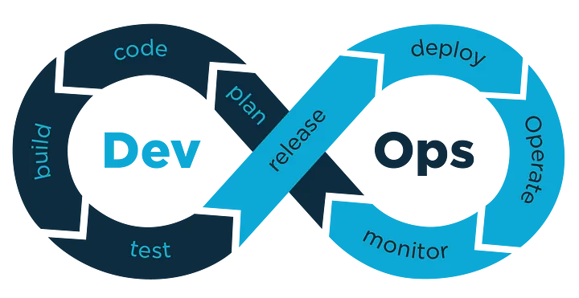

## 1. What is DevOps:
DevOps integrates development and operations teams to improve collaboration and streamline the software delivery process. It breaks down traditional silos, enabling faster and more reliable software releases.

## 2. Key Principles of DevOps:
DevOps focuses on fostering teamwork, automating repetitive tasks, and continuously improving processes through feedback and iteration, leading to better efficiency and quality.

## 3. DevOps Lifecycle:
The DevOps lifecycle includes phases like planning, development, integration, deployment, and monitoring. CI/CD pipelines ensure continuous integration and deployment, while monitoring and feedback loops drive ongoing enhancements.

## 4. Benefits of DevOps:
Organizations adopting DevOps experience quicker software delivery, higher-quality products, and the ability to scale efficiently, all while reducing downtime and operational risks.

## 5. Challenges in Implementing DevOps:
Implementing DevOps can face challenges like cultural resistance, lack of expertise, and tool integration issues. Overcoming these requires strong leadership, continuous training, and adopting the right tools and practices.

## 6. DevOps vs. Traditional IT: What Sets It Apart?
Unlike traditional IT, which operates in silos, DevOps promotes cross-functional collaboration, automation, and a continuous delivery approach, significantly enhancing agility and efficiency.

## 7. Real-World DevOps Case Studies:
Companies like Netflix and Amazon have successfully leveraged DevOps to achieve rapid deployment, high availability, and superior user experiences, setting benchmarks for industry best practices.

 

:::note[Conclusion]
This is it! By adopting DevOps, businesses can streamline processes, overcome challenges on collaboration, automation, and continuous improvement to enhance product quality and scalability and stay competitive. If you have any doubts/issues/errors with the above contents, `feel free to contact me`. Cheers, Happy learning.
:::
