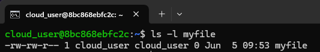

- In Linux, every file is owned by a `single user` and a `single group`, and has its `own access permissions`.
- Let’s look at how to view the ownership and permissions of a file.

- User: The owner of a file belongs to this class.
- Group: The members of the file’s group belong to this class. Group permissions are a useful way of assigning permissions on a given file to multiple users.
- Other: Any users that are not part of the user or group classes for this file belong to this class.

### Viewing Ownership and Permissions
```shell
ls -l myfile
```


### Let's see the breakdown of the above output

- Read: Indicated by an `r` in the `first position`. For a `normal file`, allows a user to `view the contents` of the file. For a `directory`, allows a user to `view the names` of the file in the directory.
- Write: Indicated by a `w` in the `second position`. For a `normal file`, allows a user to `modify and delete` the file. For a directory, allows a user to `create, delete, modify and rename` files in it.
- Execute: Indicated by an `x` in the `third position`. This permission allows a user to `execute/run` a file or program. 

### Examples of Permissions
```shell
-rw-------:  A file that is only accessible by its owner
-rwxr-xr-x:  A file that is executable by every user on the system. A world-executable file
-rw-rw-rw-:  A file that is open to modification by every user on the system. A “world-writable” file
drwxr-xr-x:  A directory that every user on the system can read and access
drwxrwx---:  A directory that is modifiable (including its contents) by its owner and group
drwxr-x---:  A directory that is accessible by its group
```

### Conclusion
That's it! You've learnt, what is file permissions and applications of them. If you have any doubts/issues/errors with the above contents, feel free to contact me. Cheers, Happy learning.
