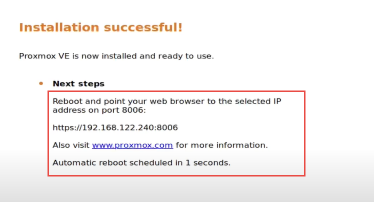

Proxmox Virtual Environment (VE) is a powerful open-source platform for managing virtual machines (VMs) and containers. If you're interested in exploring its capabilities without directly installing it on physical hardware, VirtualBox offers a convenient sandbox environment. In this guide, we'll walk you through installing Proxmox VE in VirtualBox.

:::tip[Prerequisites]
:::
- VirtualBox installed on your system (version 6.x or later is recommended).
- A downloaded Proxmox VE ISO from the Proxmox official website. [(Download here)](https://www.proxmox.com/en/downloads/proxmox-virtual-environment/iso)
- At least 8GB of RAM and 50GB of disk space available for the virtual machine.

## Step 1: Create a New Virtual Machine in VirtualBox

1. Open VirtualBox and click the New button to create a new VM.
2. Leave ISO image unselected/blank.
3. Enter a name, e.g., `Proxmox VE`.
    Select:
    - Type: `BSD`
    - Version: `FreeBSD (64-bit)`
    - Click: `Next`

4. Allocate     
    - 4GB or more of RAM. (Proxmox runs smoothly with at least 4GB.)
    - 3 CPUs
    - Click: `Next`

5. Select
    - Create virtual hard disk now
    - Allocate `50 GB` for storage
    - Click `Next`

6. Verify the summary and Click `Finish`

## Step 2: Configure the Virtual Machine
Before starting the VM, adjust some of its settings:
1. Go settings > Network:
    - Select `Bridge Adapter` for Adapter 1
    - Click `OK`

2. Go to Storage:
    - Select CD/Drive Option
    - Choose the proxmox ISO image file and attach it.
    - Click `OK`

## Step 3: Start the Virtual Machine and Install Proxmox VE
1. Start the VM by clicking the Start button in VirtualBox.
2. The Proxmox VE installer will load. Select Install Proxmox VE.
3. Follow the installation prompts:
    - Accept the EULA.
        
    - Select the virtual disk for installation.
        
    - Set up a root password and email.
        
    - Configure network settings (use a static IP for better management).
        
4. Once the installation completes, the system will prompt you to remove the installation media and reboot.

## Step 4: Access the Proxmox Web Interface
1. Note the IP address displayed on the console (e.g., `https://192.168.1.10:8006`).

2. Open a web browser and enter the IP address and login to the console.
3. That's is, Start exploring.

## Step 5: Post-Installation Tips
Now that Proxmox VE is installed:
- `Update the system:` Use the web interface or SSH to apply the latest updates.
- `Explore the web interface:` Create VMs, manage containers, or test clustering.
- `Install VirtualBox Guest Additions:` Improve performance and enable features like clipboard sharing.

 

:::note[Conclusion]
This is it! You've learnt to install the Proxmox in your virtual box. With this setup, you can test configurations, run virtual machines, and learn how Proxmox works in a controlled environment. If you have any doubts/issues/errors with the above contents, feel free to contact me. Cheers, Happy virtualizing!
:::
