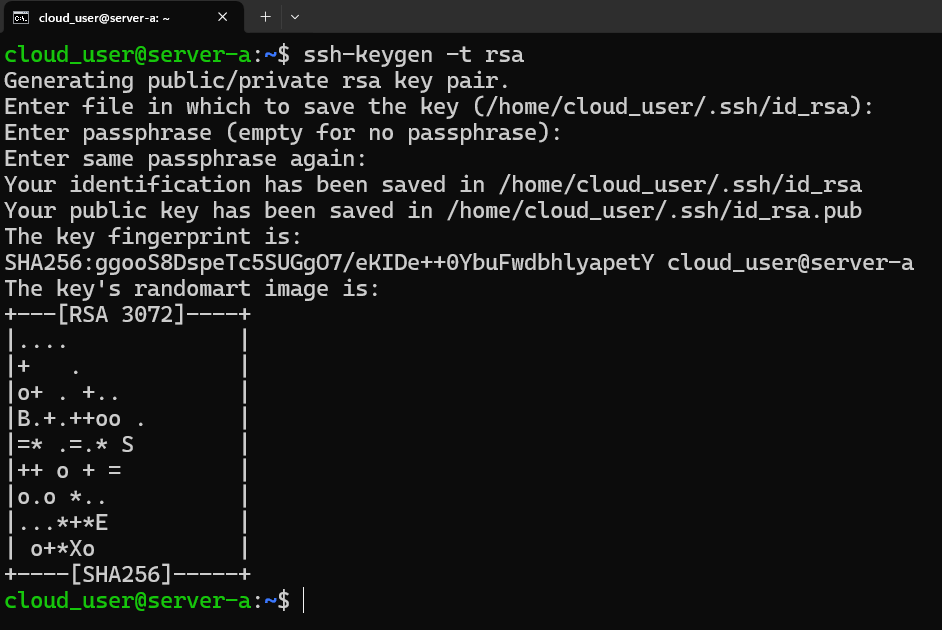
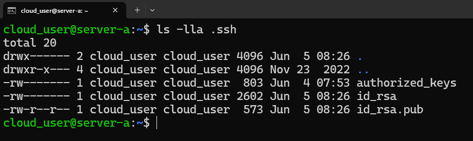
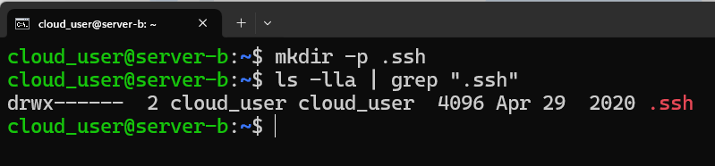

<br>

:::important
All the tutorials/steps provided here is only for educational purpose. Use/practise them wisely.
:::

## `What is SSH Protocol`

- SSH (Secure SHELL) is an open-source and trusted network protocol that is used to log in to remote servers for the execution of commands and programs.

- It is also used to transfer files from one computer to another computer over the network using a secure copy (SCP) command and rsync command.


## `How to configure password less authentication`
:::important
This tutorial will walk you step by step through how to set up SSH passwordless login to a Linux server. Here, we have two servers. (`server a` and `server b`)
:::

1. Now, Login to `server a` and generate a key pair.
```shell
ssh user@server-a
ssh-keygen -t rsa
```

2. When prompted, enter a filename and passphrase (if required).


3. Ensure the keys are generated at `/home/cloud_user/.ssh/id_rsa`.
- id_rsa contains the private key
- id_rsa.pub contains the public key

<!-- 

 -->
<!--  -->

4. Now, login to `server b` and create SSH directory.
```shell
mkdir -p .ssh
ls -lla | grep ".ssh"
```


5. Upload the public key of `server a` to `server b`
```shell
ssh-copy-id user@server-b
```

6. Test the SSH Passwordless Login from `server a` to `server b` without password.
```shell
ssh user@server-b
```
## `Optional Steps: Additional Configurations and Troubleshooting`

1. Ensure the correct permissions are set on your .ssh directory and files:
- On `server a`
```shell
ssh user@server-a
chmod 700 ~/.ssh
chmod 600 ~/.ssh/id_rsa
chmod 644 ~/.ssh/id_rsa.pub
```

- On `server b`
```shell
ssh user@server-b
chmod 700 ~/.ssh
chmod 600 ~/.ssh/authorized_keys
```

### Conclusion
That's it! You've successfully configured the passwordless authentication from your local machine to remote machines. If you have any doubts/issues/errors with the above contents, feel free to contact me through e-mail. Cheers, Happy learning.
