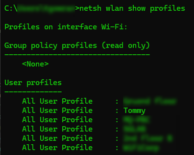
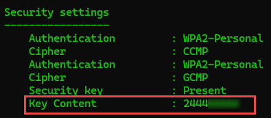

<br>

:::important
All the tutorials/steps provided here is only for educational purpose. Use/practise them wisely.
:::

# Open `command prompt` or `terminal` in your computer
1. List all the connected network names
```shell
netsh wlan show profiles
```


- In the above picture, you can see that, all the networks my machine connected to, are listing.
- Here, note the network name, for which you wanted to retrive the password and then go for step 2. 

<br>

2. Describe the specific details for the network.

- Here, execute the below command with replacing your network name

```powershell
netsh wlan show profiles name="netwokr-name" key=clear -- (Example)

I wish to retrive password for the network "Tommy".

netsh wlan show profiles name="Tommy" key=clear
```


- You can find the password for the specific wifi network name `Tommy` in `Security settings`

### Conclusion
That's it! You've learnt, how to retrive a saved password from your windows machine using command prompt. If you have any doubts/issues/errors with the above contents, feel free to contact me. Cheers, Happy learning.
